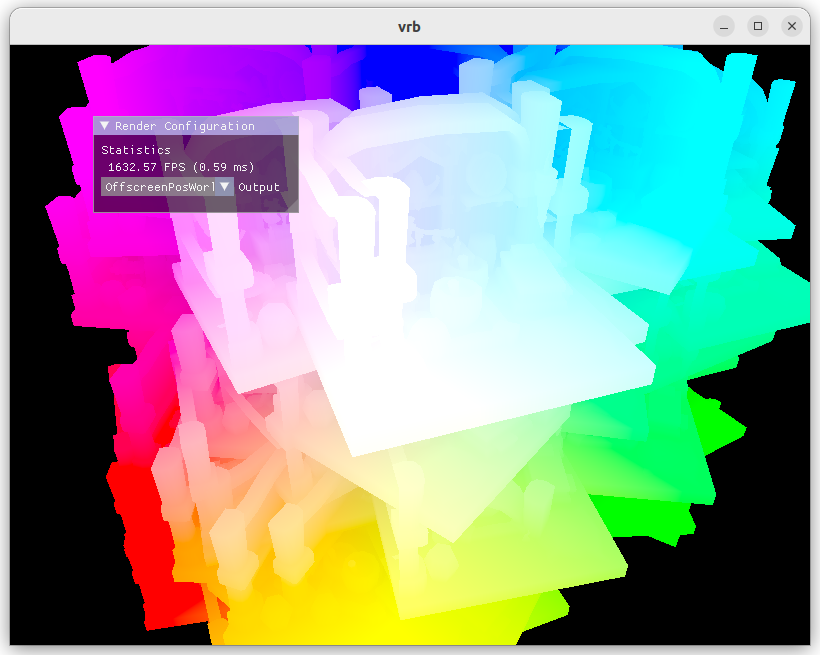

# vulkan_render_base

A prototype-oriented Vulkan rendering engine. A lot of parts has inspired by several tutorials and examples. I started this project with following the great [Vulkan Tutorial](https://vulkan-tutorial.com/), but now it has a slightly different architecture and additional features.

Currently it has only been tested on Ubuntu 22.04.

## Prerequisites

- Vulkan SDK
- glslangValidator
- GLFW3
- GLM

## Features

- [x] Vulkan context initialization and some wrappers
- [x] Render pass abstraction
- [x] GUI
- [x] Rasterized G-buffer rendering pass template
- [ ] Ray-traced G-buffer rendering pass template
- [ ] Reference unbiased path tracer

## External libraries

- [stb](https://github.com/nothings/stb) for image I/O (public domain)
- [Dear ImGui](https://github.com/ocornut/imgui) for GUI (MIT license)
- [tinyobjloader](https://github.com/tinyobjloader/tinyobjloader) for OBJ data loading (MIT license)

## Good references and resources

Vulkan tutorials and samples

- [Vulkan Tutorial by Alexander Overvoorde](https://vulkan-tutorial.com/)
- [Vulkan Ray Tracing Tutorials by NVIDIA](https://github.com/nvpro-samples/vk_raytracing_tutorial_KHR)
- [Vulkan Samples by Khronos Group](https://github.com/KhronosGroup/Vulkan-Samples)
- [Vulkan-Hpp Samples by Khronos Group](https://github.com/KhronosGroup/Vulkan-Hpp/tree/master/samples)
- [Ray Tracing Gems II](http://www.realtimerendering.com/raytracinggems/rtg2/)

CMake structure and shader compilation

- [https://github.com/zeux/niagara/blob/master/CMakeLists.txt](https://github.com/zeux/niagara/blob/master/CMakeLists.txt)
- [https://github.com/KhronosGroup/Vulkan-Tools/blob/master/cube/CMakeLists.txt](https://github.com/KhronosGroup/Vulkan-Tools/blob/master/cube/CMakeLists.txt)