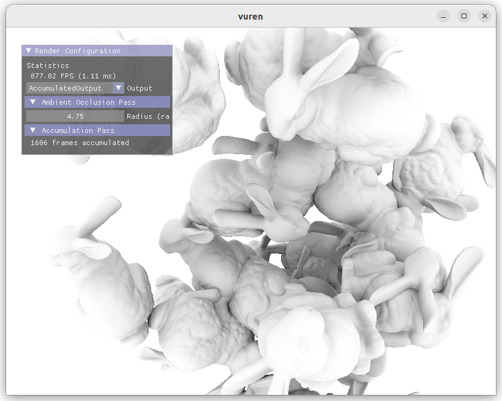

# vuren



A prototype-oriented Vulkan rendering engine. A lot of parts has inspired by several tutorials and examples. I started this project with following the great [Vulkan Tutorial](https://vulkan-tutorial.com/), but now it has a different architecture and additional features.

Currently it has only been tested on Ubuntu 22.04 and Windows 10 with NVIDIA RTX GPUs.

## Features

- [x] Vulkan context initialization
- [x] OBJ mesh loading and instanced rendering
- [x] Rendering resource management
- [x] GUI
- [x] Render pass abstraction
- [x] Render pass templates
    - [x] Rasterized G-buffer rendering
    - [x] Ray-traced G-buffer rendering
    - [x] Ray-traced ambient occlusion
    - [x] Temporal accumulation
    - [ ] Reference unbiased path tracer
- [x] Camera manipulation

## Prerequisites

- Graphics card and driver providing hardware ray tracing
- Vulkan SDK 1.2 or later
- CMake 3.20 or later

## Building the project

First, clone the repository:

```bash
git clone --recursive https://github.com/mistralk/vuren.git
```

If you forgot to add `--recursive` option for cloning, run the following command:

```bash
git submodule update --init --recursive
```

### Ubuntu

First of all, you need to install some vulkan-related developer packages and glslangValidator. Also you might need to install X11 development packages `xorg-dev` for GLFW:

```bash
sudo apt install libvulkan-dev vulkan-validationlayers-dev spirv-tools glslang-tools xorg-dev
```

Now you can build the project by run the following commands in the project root directory:

```bash
mkdir build
cd build
cmake ..
make -j $(nproc)
```

Also you can specify the build type(Debug or Release) before running the cmake command.

Finally, to run the application:

```bash
./vuren
```

### Windows (Visual Studio)

In Windows, Visual Studio 2019 or later, CMake 3.20 or later, and [the latest Vulkan SDK](https://vulkan.lunarg.com/sdk/home) are required. Then you can configure and generate the Visual Studio `.sln` file from CMake GUI. 

## Licenses

External libraries
- [GLFW](https://github.com/glfw/glfw) for window management and device input (the zlib/libpng license)
- [GLM](https://github.com/g-truc/glm) for math in host code (the MIT license)
- [stb](https://github.com/nothings/stb) for image I/O (public domain)
- [Dear ImGui](https://github.com/ocornut/imgui) for GUI (the MIT license)
- [tinyobjloader](https://github.com/tinyobjloader/tinyobjloader) for OBJ data loading (the MIT license)

Assets
- [Viking room](https://sketchfab.com/3d-models/viking-room-a49f1b8e4f5c4ecf9e1fe7d81915ad38) model by nigelgoh (CC BY 4.0), tweaked by [Alexander Overvoorde](https://vulkan-tutorial.com/Loading_models)
- [Stanford bunny](http://www.graphics.stanford.edu/data/3Dscanrep/) model by The Stanford 3D Scanning Repository, tweaked by [Morgan McGuire](https://casual-effects.com/data/)