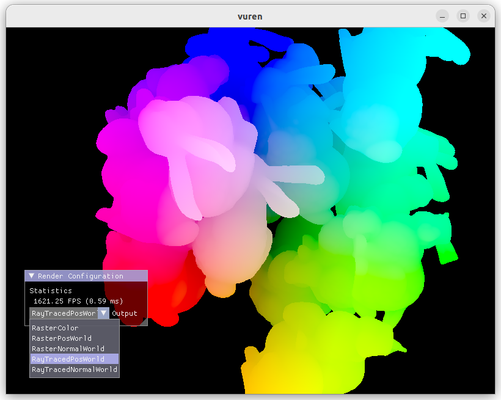

# vuren

A prototype-oriented Vulkan rendering engine. A lot of parts has inspired by several tutorials and examples. I started this project with following the great [Vulkan Tutorial](https://vulkan-tutorial.com/), but now it has a different architecture and additional features.

Currently it has only been tested on Ubuntu 22.04 and NVIDIA RTX GPU.

## Prerequisites

- Graphics card and driver providing Vulkan 1.2+ support and hardware ray tracing
- Vulkan SDK
- glslangValidator
- GLFW3
- GLM
- CMake 3.20+

## Features

- [x] Vulkan context initialization
- [x] OBJ mesh loading and instanced rendering
- [x] Rendering resource management
- [x] GUI
- [x] Render pass abstraction
- [x] Render pass templates
    - [x] Rasterized G-buffer rendering
    - [x] Ray-traced G-buffer rendering
    - [x] Ray-traced ambient occlusion
    - [x] Temporal accumulation
    - [ ] Reference unbiased path tracer
- [ ] Cemera manipulation

## Licenses

External libraries
- [stb](https://github.com/nothings/stb) for image I/O (public domain)
- [Dear ImGui](https://github.com/ocornut/imgui) for GUI (The MIT license)
- [tinyobjloader](https://github.com/tinyobjloader/tinyobjloader) for OBJ data loading (The MIT license)

Assets
- [Viking room](https://sketchfab.com/3d-models/viking-room-a49f1b8e4f5c4ecf9e1fe7d81915ad38) model by nigelgoh (CC BY 4.0), tweaked by [Alexander Overvoorde](https://vulkan-tutorial.com/Loading_models)
- [Stanford bunny](http://www.graphics.stanford.edu/data/3Dscanrep/) model by The Stanford 3D Scanning Repository, tweaked by [Morgan McGuire](https://casual-effects.com/data/)