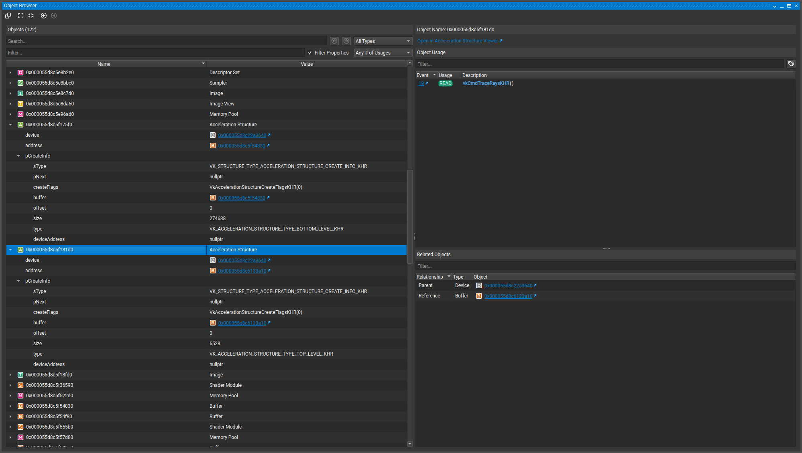
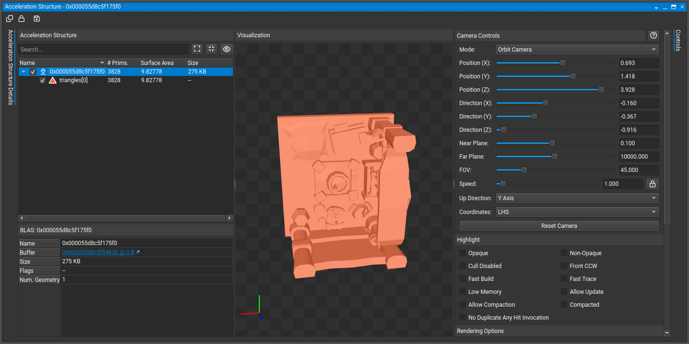
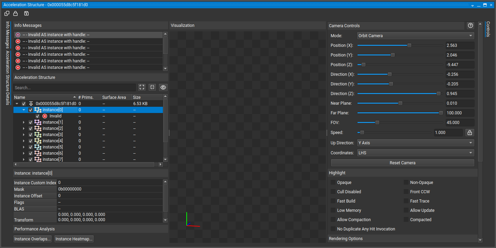
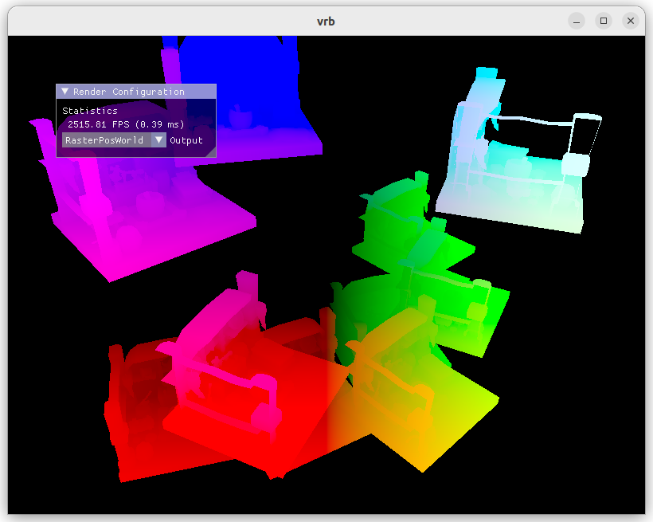
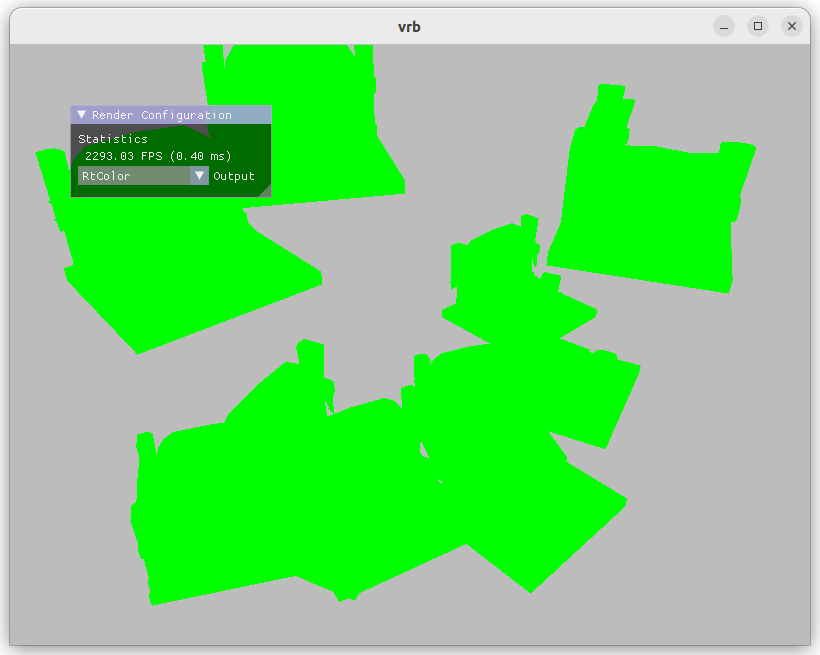

# 가속구조 디버깅 노트

2023-01-13

### 문제와 증상

- 레이 트레이싱을 열심히 구현했더니 인스턴스들이 전혀 렌더링되지 않는다.
- 이미지 버퍼 전체가 miss shader 색깔로 칠해진다.

### 추론

miss shader는 정상 작동하는 것으로 보아 shader binding table이나 파이프라인 정의에는 문제 없음 (아마도)

남은 가능성은,

1. 카메라 레이 생성을 잘못 하고 있다.
2. TLAS, BLAS 생성을 잘못 하고 있다.

### 카메라 레이 생성 체크

혹시 빼먹은게 있는지 기초부터 다시 정리해보자.

- 카메라 view/inverse view 행렬 : 카메라가 어디로부터 어디를 보는지에 대한 정보. 카메라가 왼쪽으로 이동한다는 것은, 카메라는 가만히 두고 월드를 오른쪽으로 이동하는 것과 동치. 즉 카메라 트랜스폼을 계산하려면 inverse view 행렬을 사용해야함. 카메라 레이 역시 카메라를 따라 트랜스폼 해야 한다.

```cpp
const vec2 pixelCenter = vec2(gl_LaunchIDEXT.xy) + vec2(0.5);
const vec2 inUV = pixelCenter / vec2(gl_LaunchSizeEXT.xy);
vec2 d = inUV * 2.0 - 1.0;

vec4 origin = camera.invView * vec4(0, 0, 0, 1);
vec4 target = camera.invProj * vec4(d.x, d.y, 1, 1);
vec4 direction = camera.invView * vec4(normalize(target.xyz), 0);
```

- gl_LaunchIDEXT: width × height × depth
- d = gl_LaunchIDEXT의 NDC 좌표. [-1, 1]
- origin = 카메라 뷰의 인버스 * 원점. 원점을 카메라의 월드좌표로 이동 (월드 트랜스폼)
- target = NDC 좌표란 월드 스페이스의 포인트를 카메라 앞의 이미지 플레인에 프로젝션한 좌표이므로, 이를 다시 월드 좌표로 역투영해야 함 (inverse projection)
- direction = 해당 월드 좌표를 노멀라이즈한 것에 inverse view를 곱해서 카메라 위치 기준으로 이동

인스턴스별로 저장된 트랜스폼에 대해
- glm 트랜스폼은 메모리에 column-major로 저장된다. (배열의 4행이 tranlate, 4열은 [0,0,0,1])
- vulkan의 트랜스폼은 메모리에 row-major로 저장된다.
- 따라서 BLAS 생성시 트랜스폼 매트릭스는 column-major -> row-major로 transpose 필요

Vulkan의 좌표계에 대해
- Vulkan에서 z 좌표는 [near=0, far=1]. glm은 OpenGL을 따라 [-1, 1]로 정의되어 있으나, `#define GLM_FORCE_DEPTH_ZERO_TO_ONE`을 통해 알아서 처리
- y 역시 OpenGL과 반대이므로 플립이 필요 (top-left가 (-1, -1), bottom-right가 (1, 1))

필요한 사항은 전부 작성되어 있으므로 카메라에는 문제가 없어 보인다. 그렇다면 높은 확률로 AS 문제?

### TLAS, BLAS 체크

RenderDoc은 레이 트레이싱을 지원하지 않기 때문에 어떻게 디버깅할지 막막하던 찰나, Nsight Graphics가 AS 뷰어를 지원한다는 사실을 알고 사용해봤다. 

BLAS와 TLAS 오브젝트 자체는 잘 생성됐음이 확인된다:



BLAS도 정상적으로 메시 오브젝트를 저장하고 있다:



TLAS에 인스턴스들이 제대로 저장되고 있지 않음을 확인:



BLAS는 제대로 생성됐는데 TLAS가 버퍼를 제대로 가리키고 있지 않은 것 같다. 버퍼 할당 및 주소 전달 관련 코드를 열심히 살펴보다가 실수를 발견했다.

```cpp
Buffer instanceBuffer = createBuffer(*m_pContext, instanceCount * sizeof(vk::AccelerationStructureInstanceKHR), vk::BufferUsageFlagBits::eShaderDeviceAddress | vk::BufferUsageFlagBits::eAccelerationStructureBuildInputReadOnlyKHR, vk::MemoryPropertyFlagBits::eDeviceLocal);
vk::BufferDeviceAddressInfo addressInfo = { .buffer = instanceBuffer.descriptorInfo.buffer };
vk::DeviceAddress instanceBufferAddress = m_pContext->m_device.getBufferAddress(&addressInfo);
```

createBuffer() 함수를 호출해서 인스턴스 버퍼(BLAS 버퍼)를 생성하고는 있는데, 호스트의 실제 BLAS 데이터를 전혀 전달하지 않고 있었다. 다른 기능 구현하느라 일단 필요에 따라 createBuffer(), createVertexBuffer(), createIndexBuffer(), createUniformBuffer() 등등 함수를 ad-hoc하게 정의해주고 있던게 화근이 됐다.

인스턴스 버퍼뿐만 아니라 버텍스 버퍼 생성, 인덱스 버퍼 생성 등 비슷한 기능이 프로그램 내내 사용되고 있으므로 일단 다음같은 템플릿 함수를 정의해서 호출

```cpp
template <typename DataType>
Buffer createBufferByHostData(const std::vector<DataType>& hostData, vk::BufferUsageFlags bufferUsage, vk::MemoryPropertyFlags memoryProperty)
```

수정 결과





레이 트레이싱도 잘 된다.